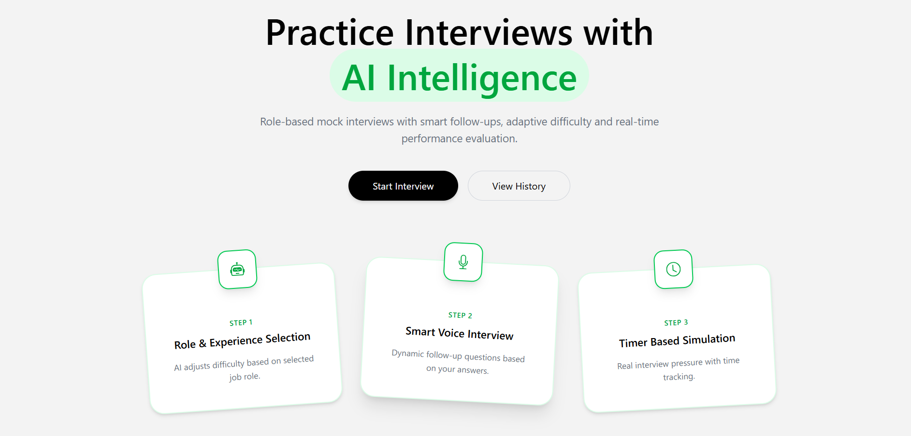

<!DOCTYPE html>
<html lang="en">
<head>
  <meta charset="UTF-8">
  <meta name="viewport" content="width=device-width, initial-scale=1.0">
  <title>InterviewIQ.AI</title>
</head>
<body>

<h1>🚀 InterviewIQ.AI</h1>

<b>AI Powered Smart Interview Platform</b> 
Practice interviews with AI intelligence, adaptive questioning, and real-time performance evaluation.

<!-- 🔥 LIVE DEMO ADDED HERE -->

<h2>🌐 Live Demo</h2>

  

  👉 <b>Try the app live and generate AI-powered notes instantly.</b>

  🔗 

<h2>🚀 Live Demo</h2>

Experience InterviewIQ.AI in action — practice AI-powered mock interviews.

✅ Authentication   •   🤖 AI Interviews   •   📊 Dashboard   •   💳 Payments

<h2>📸 Project Preview</h2>

  

<b>Practice Interviews with AI Intelligence</b>

<h2>📌 Overview</h2>

InterviewIQ.AI is an AI-driven mock interview platform that simulates real interview environments. It provides role-based interviews, dynamic follow-up questions, and performance analytics to help users improve their skills.

<h2>✨ Features</h2>

🤖 AI-Powered Interview System 
🎯 Role-based customization 
🧠 Smart follow-up questions 
⏱️ Timer-based simulation 
📊 Performance analytics 
📄 PDF reports 
🎤 Voice-based interviews 
💳 Premium sessions

<h2>🧩 How It Works</h2>

1. Role Selection 
Select job role and experience level.  

2. AI Interview 
AI generates dynamic questions and follow-ups.  

3. Real Simulation 
Timer-based interview experience.

<h2>🧠 AI Capabilities</h2>

Answer Evaluation: Communication & accuracy scoring 
Resume-based Questions 
Confidence Detection 
Analytics Tracking

<h2>🛠️ Tech Stack</h2>

Frontend: React (Vite) 
Backend: Node.js, Express 
Database: MongoDB 
Auth: JWT + Cookies 
AI: OpenAI APIs 
Payments: Razorpay / Cashfree

<h2>🔁 Architecture</h2>

<pre>
flowchart LR

A[👤 User Browser]
A --> B[⚛️ Frontend (React + Vite)]
B -->|REST API| C[🟢 Backend (Node.js + Express)]
C --> D[🔐 Auth Service (JWT + Cookies)]
C --> E[🧠 Interview Engine]
C --> F[💳 Payment Service]
E --> G[🤖 OpenAI API]
F --> H[🏦 Payment Gateway (Razorpay / Cashfree)]
C --> I[(🗄️ MongoDB)]
I -->|User Data| C
I -->|Interview Data| C
I -->|Payment Data| C
C -->|JSON Response| B
B -->|Rendered UI| A
</pre>

<h2>📂 Project Structure</h2>

<pre>
InterviewIQ/
│
├── client/                  
│   ├── src/
│   ├── public/
│   └── ...
│
├── server/                  
│   ├── config/
│   ├── controllers/
│   ├── models/
│   ├── routes/
│   ├── services/
│   └── ...
│
└── README.md
</pre>

<h2>⚙️ Installation</h2>

<pre>
git clone https://github.com/anup-verma01/InterviewIQ.AI
cd interviewiq-ai
</pre>

<b>Client</b>

<pre>
cd client
npm install
npm run dev
</pre>

<b>Server</b>

<pre>
cd server
npm install
npm run dev
</pre>

<b>Environment Variables</b>

<pre>
MONGO_URI=
JWT_SECRET=
OPENAI_API_KEY=
RAZORPAY_KEY=
</pre>

<h2>🚀 Future Improvements</h2>

📹 Video interviews 
🌐 Multi-language 
📱 Mobile app

<h2>🤝 Contributing</h2>

Fork and create a pull request.

<h2>📜 License</h2>

MIT License

<b>💡 Built by Anup Kumar Verma</b>

⭐ Star this repo if you like it!

</body>
</html>
